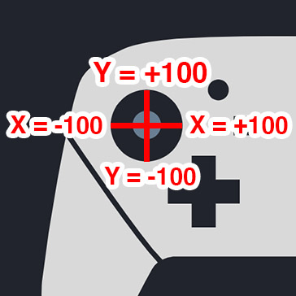

# Writing an NXBT Macro

### Basic Macro script

Every macro script is composed of Button/Stick input followed by a set duration. Here is a sample of this.

```
B 0.1s
```

The above macro is setting the B button to be pressed for 0.1s (0.1 seconds).

Oftentimes you'll need gaps between your inputs when no buttons should be pressed. This is easily scripted by making a new line and inserting a new time.

```
B 0.1s
1s
```

This is effectively a single B button press. NXBT will then wait 1 second before moving to the next action.

### Advanced Macros

To set multiple inputs simultaneously, we write our inputs on the same line, separated by a space, followed by the duration. This is how our script looks now.

```
A B 0.5s
B 0.1s
0.1s
```

First, This new macro has both the A and B buttons pressed for 0.5s. Next, the A button is released and the B button continues to be held for an additional 0.1s. Finally, no buttons are pressed for 0.1s.

The above macros deal with only button-based input. A stick input example follows:

```
L_STICK@-100+000 0.75s
1.0s
```

Above, we're setting the left analog stick to 100% in the left horizontal direction. To explain, analog stick positions are composed of two values: an X position and a Y position. You can think of both as positions on a traditional X/Y plane, with X being the horizontal component and Y being the vertical component. An X/Y of 0/0 means that the analog stick is in a neutral position (no input), while an X/Y position of 0/100 means our stick is tilted 100% up.

<div align="center">
  
</div>

To be clear, the first numeric argument after L_STICK@ is the X value and the second is the Y value. Eg: An X value of 50 and a Y Value of 25 on the right stick would be `R_STICK@+050+025`.

As such, a neutral stick position is as follows:

```
L_STICK@+000+000 0.75s
1.0s
```


Remember, each X and Y value must be 3 digits. If you want to tilt the Right Thumbstick 75% to the left, you must write it as `R_STICK@-075+000`. Another thing to keep in mind, the sum of your X and Y can be more than 100. For example, `L_STICK@+100+100` is a 45° angle. 


### Loops

A simple for-loop can be used to repeat a macro block a specified number of times. The below example loops through an indented macro block 100 times.

```
LOOP 100
    B 0.1s
    0.1s
```

Nested loops are also supported.

```
LOOP 100
    B 0.1s
    0.1s
    # Nested loop
    LOOP 5
        A 0.1s
        0.1s
```

Note, a macro line starting with `#` is ignored.

## Macro Control Values

| Macro Value | Control Name |
--- | ---
Y | Y Button
X | X Button
B | B Button
A | A Button
JCL_SR | Left Joy-Con SR
JCL_SL | Left Joy-Con SL
R | Upper Right Shoulder Trigger
ZR | Lower Right Shoulder Trigger
MINUS | Minus Button
PLUS | Plus Button
R_STICK_PRESS | Right Stick Press
L_STICK_PRESS | Left Stick Press
HOME | Home Button
CAPTURE | Capture Button
DPAD_DOWN | Down Button on the DPad
DPAD_UP | Up Button on the DPad
DPAD_RIGHT | Right Button on the DPad
DPAD_LEFT | Left Button on the DPad
JCR_SR | Right Joy-Con SR
JCR_SL | Right Joy-Con SL
L | Upper Left Shoulder Trigger
ZL | Lower Left Should Trigger
